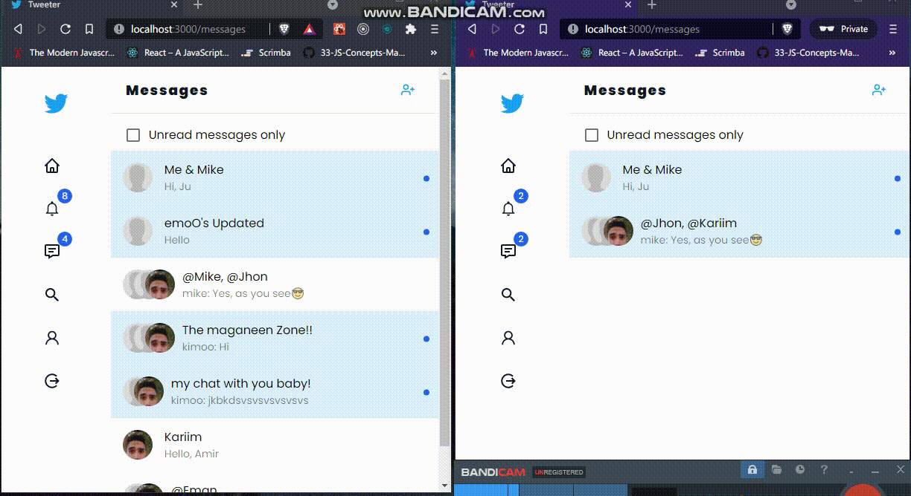
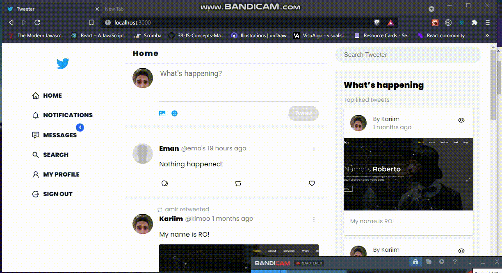

# Tweeter App - Twitter like App

### Twitter clone built by Typescript, React/ContextAPI, Node and MongoDB.

## Core Features

<ul>
  <li>Auth - SigUp/SignIn</li>
  <li>Tweet creation with text, images and emojis</li>
  <li>Tweet like, retweet and reply</li>
  <li>Following system</li>
  <li>Edit profile</li>
  <li>Search in users and tweets</li>
  <li>Real-Time notifications</li>
  <li>Real-Time messages</li>
</ul>

## Demo

#### Fully-Responsive

#### Chat

### Notification Page

### Tweeta create and search

### Group Chat

### User Profile

### Real-Time Notification

